# FIFA World Cup 2026 Winner Predictor & Simulator

<p align="center">
  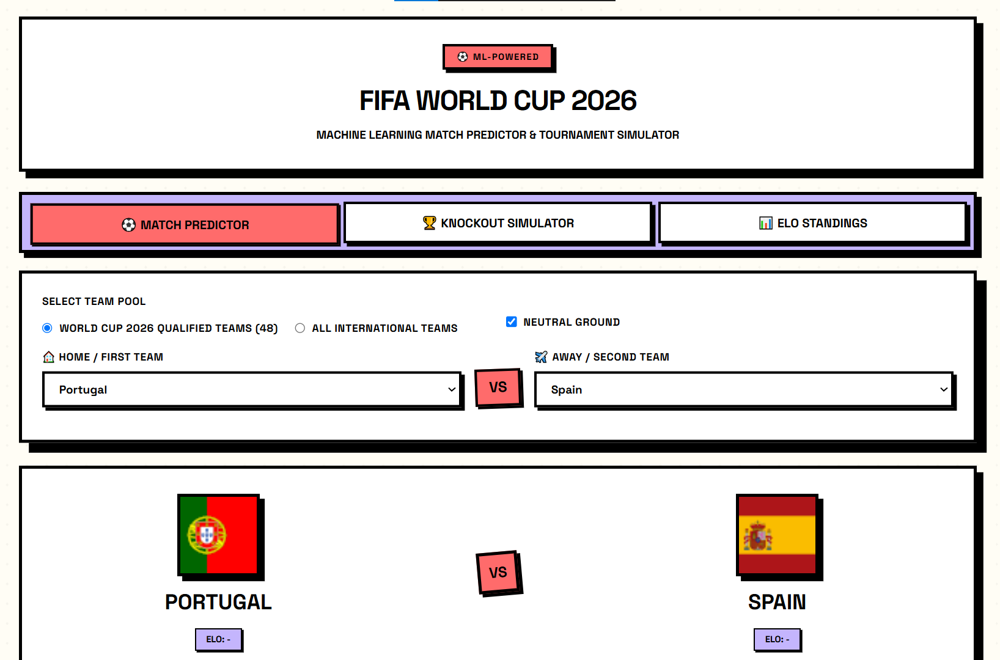
</p>

<table align="center">
  <tr>
    <td width="50%">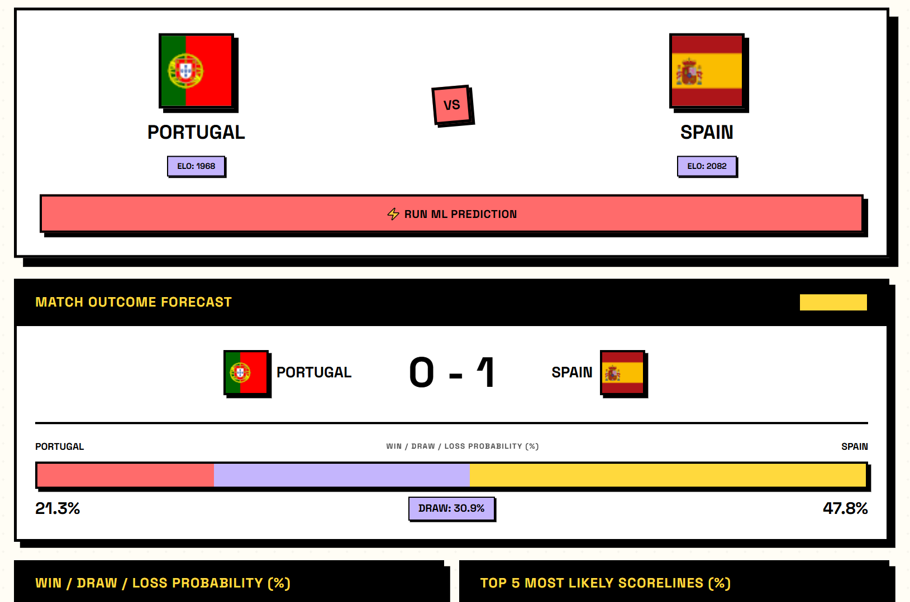</td>
    <td width="50%">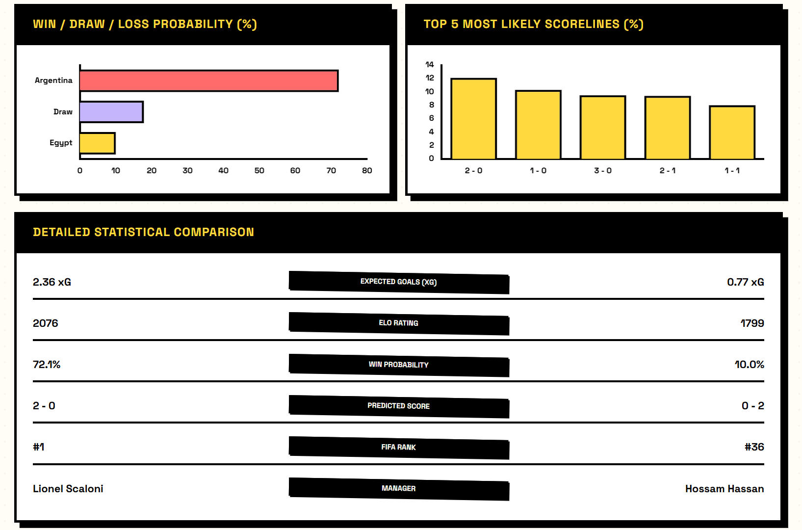</td>
  </tr>
  <tr>
    <td width="50%">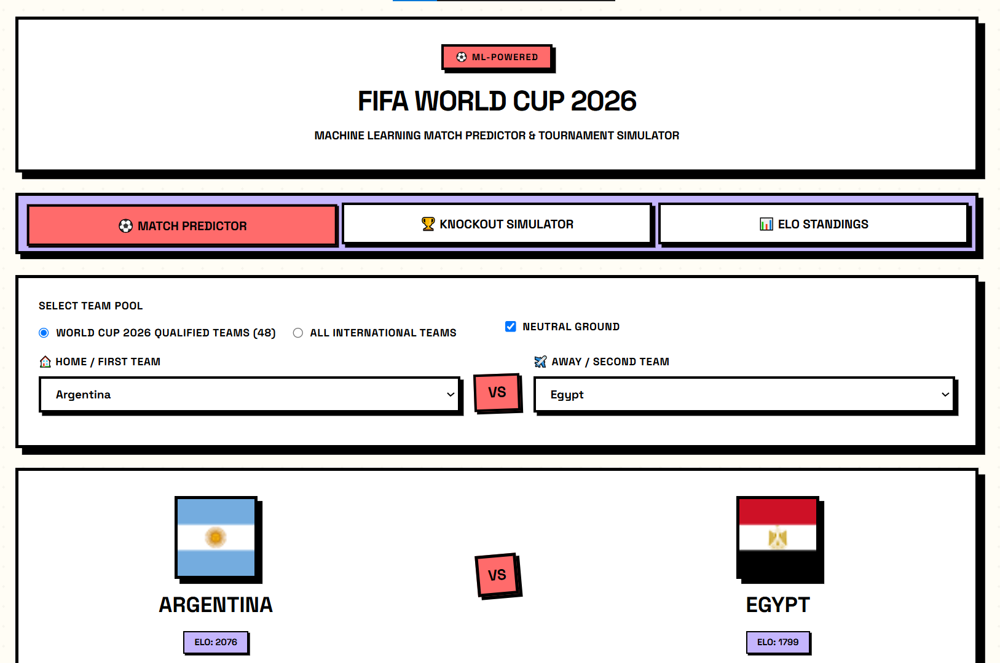</td>
    <td width="50%">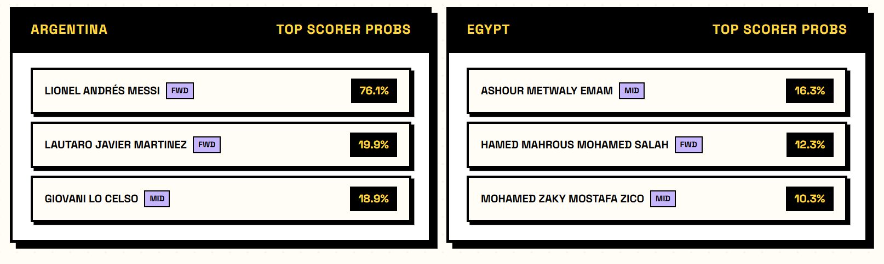</td>
  </tr>
</table>

An AI-powered, machine learning application that predicts international football matches and simulates the FIFA World Cup 2026 knockout stages using historical data since 1872.

## Key Features

- **Dynamic ELO Ratings System**: Calculates ELO ratings chronologically for all 49,000+ international football matches since 1872, capturing long-term strength and recent form.
- **Random Forest Classifier**: Trained on historical ELO ratings and match contexts to predict the probabilities of Home Win, Draw, or Away Win outcomes.
- **Expected Goals (xG) & Outcome-Constrained Poisson Mode**: Calculates expected goals (xG) using ELO discrepancies and home advantage. The predicted scoreline is chosen mathematically as the most probable scoreline matching the predicted outcome under joint Poisson distributions.
- **Monte Carlo Bracket Simulation**: Runs a 5,000-run Monte Carlo simulation of the 2026 knockout bracket, updating team ELO ratings dynamically after every match to account for tournament momentum.
- **Live Interactive UI**: A custom Neo-brutalist web dashboard showing live match predictions, win/draw/loss probability tracks, top 5 most likely scorelines (rendered using Chart.js), player goalscorer probabilities, and interactive knockout bracket simulators.

---

## Technology Stack

- **Frontend**: HTML5, Vanilla CSS3 (Custom Neo-brutalist Theme), JavaScript (ES6+), Chart.js
- **Backend**: FastAPI (Python 3.13), Uvicorn (ASGI Server)
- **Data & ML**: Scikit-Learn (Random Forest), Pandas, NumPy

---

## Project Structure

- `server.py`: FastAPI server serving prediction and simulation APIs.
- `train_fifa_model.py`: Script to download historical data, compute ELOs, train the Random Forest model, and save model assets (`rf_model.pkl`, `team_elos.pkl`).
- `static/`: Contains the frontend web application:
  - `index.html`: The UI layout.
  - `style.css`: The Neo-brutalist stylesheet (vibrant colors, clean borders, custom typography).
  - `app.js`: Connects the frontend UI to FastAPI backend endpoints and renders Chart.js visualizations.
- `teams.csv`: Participating 48 nations, their managers, initial ELO, and groups.
- `player_stats.csv`: Tournament goal, assist, and position statistics for player goalscorer forecasting.
- `FIFA_Core_Logic.txt`: Detailed explanation and Python code snippets of the core ELO, ML, Poisson, and simulation algorithms.

---

## Setup & Execution

### 1. Install Dependencies
Make sure you have Python 3.10+ installed. Install the required libraries:
```bash
pip install fastapi uvicorn pandas numpy scikit-learn
```

### 2. Retrain the Model (Optional)
To fetch the latest match data and retrain the Random Forest model:
```bash
python train_fifa_model.py
```
This generates:
- `rf_model.pkl`: The serialized Random Forest classifier.
- `team_elos.pkl`: The serialized final ELO ratings.

### 3. Run the Application
Start the FastAPI server:
```bash
uvicorn server:app --host 0.0.0.0 --port 8000
```
Open your browser and navigate to:
```
http://localhost:8000/
```

---

## Core Prediction Methodology

### ELO Rating Updates
Expected outcome ($P_{\text{home}}$) for the Home Team:
$$P_{\text{home}} = \frac{1}{1 + 10^{(R_{\text{away}} - R_{\text{home}}) / 400}}$$

ELO Rating post-match adjustment:
$$R'_{\text{home}} = R_{\text{home}} + K \cdot (W_{\text{actual}} - P_{\text{home}})$$
$$R'_{\text{away}} = R_{\text{away}} + K \cdot ((1 - W_{\text{actual}}) - (1 - P_{\text{home}}))$$

*Where $R$ is the ELO rating, $K$ is the match significance coefficient, and $W_{\text{actual}}$ is the actual outcome (1.0 for win, 0.5 for draw, 0.0 for loss).*

### Expected Goals (xG)
$$xG_{\text{home}} = 1.35 \cdot \left(10^{(R_{\text{home}} - R_{\text{away}} + H_{\text{venue}}) / 400}\right)^{0.35}$$
$$xG_{\text{away}} = 1.35 \cdot \left(10^{(R_{\text{away}} - R_{\text{home}} - H_{\text{venue}}) / 400}\right)^{0.35}$$

*Where $H_{\text{venue}}$ is the home advantage rating adjustment ($100$ if playing at home, $0$ if playing at a neutral venue).*

### Poisson Probability Scoreline Selection
$$\text{P}(G_1 = g_1, G_2 = g_2) = \frac{e^{-xG_1} \cdot xG_1^{g_1}}{g_1!} \cdot \frac{e^{-xG_2} \cdot xG_2^{g_2}}{g_2!}$$

The predicted match scoreline is chosen as the argmax (mode) of $\text{P}(G_1 = g_1, G_2 = g_2)$ constrained by the outcome class predicted by the Random Forest model:
- **Home Win**: $g_1 > g_2$
- **Draw**: $g_1 = g_2$
- **Away Win**: $g_1 < g_2$

---

## Project Presentation & Methodology Slides

Here are the detailed presentation slides outlining the tournament simulation rules, logic, and dataset context:

<details>
  <summary>Click to expand and view the 15 presentation slides</summary>
  <br/>
  <p align="center">
    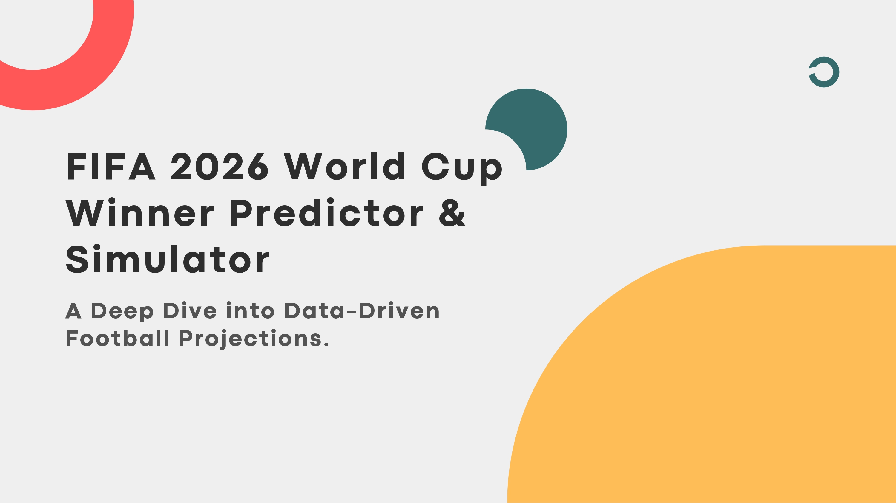<br/><br/>
    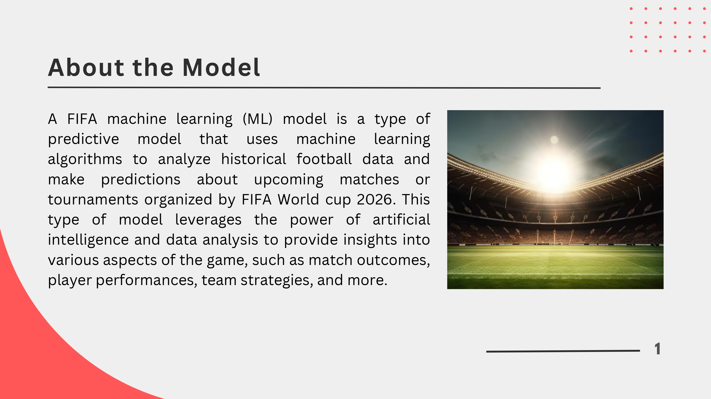<br/><br/>
    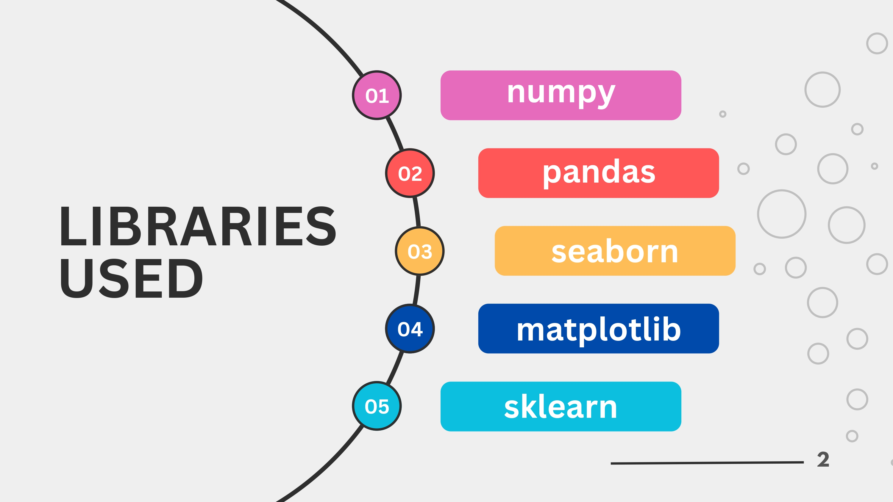<br/><br/>
    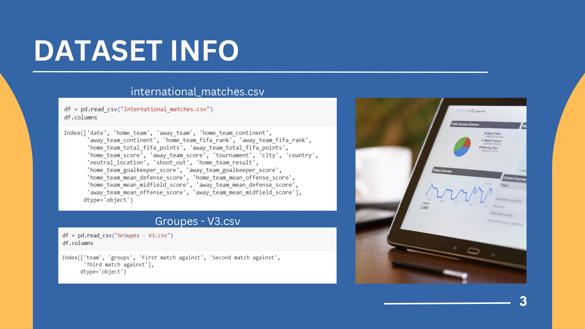<br/><br/>
    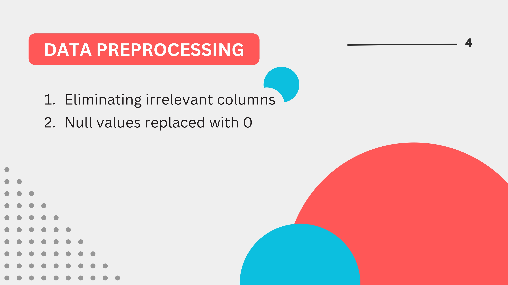<br/><br/>
    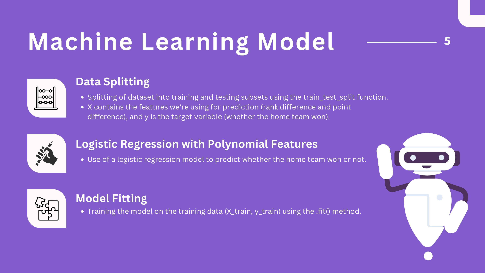<br/><br/>
    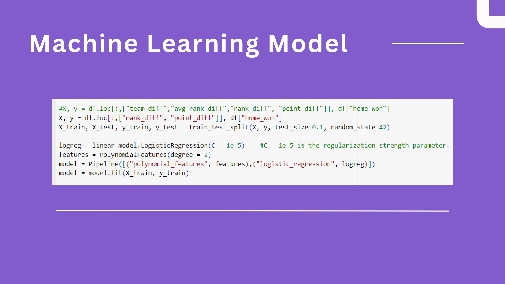<br/><br/>
    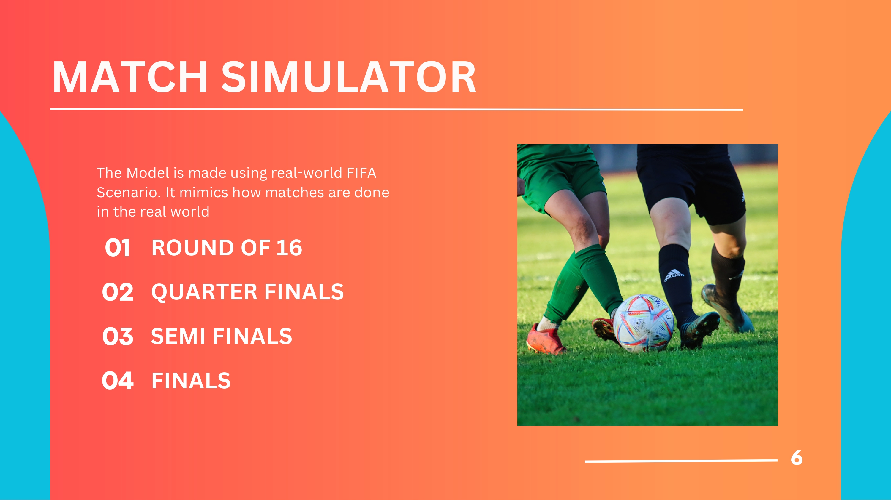<br/><br/>
    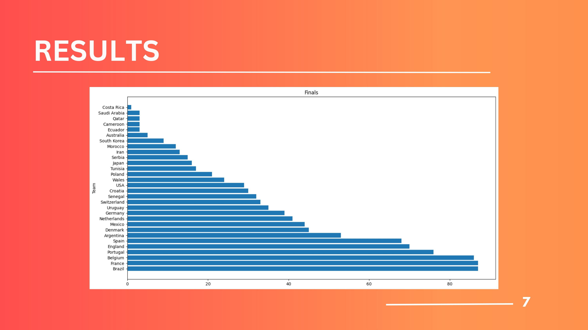<br/><br/>
    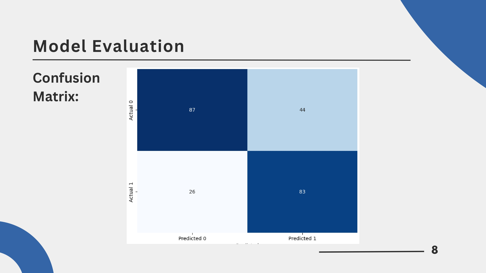<br/><br/>
    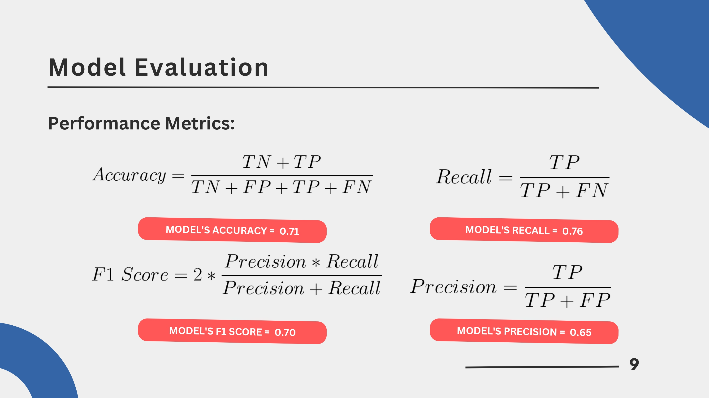<br/><br/>
    <br/><br/>
    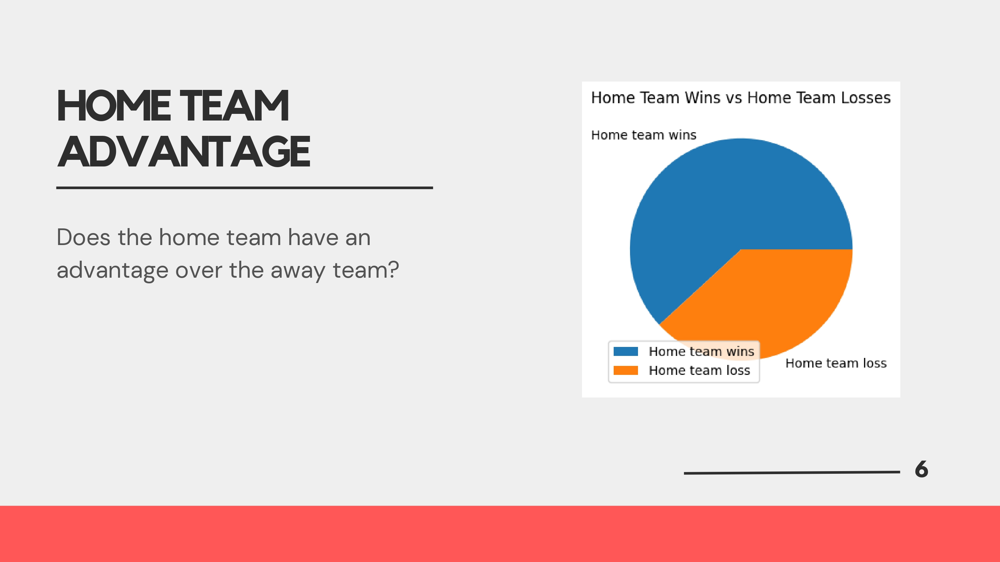<br/><br/>
    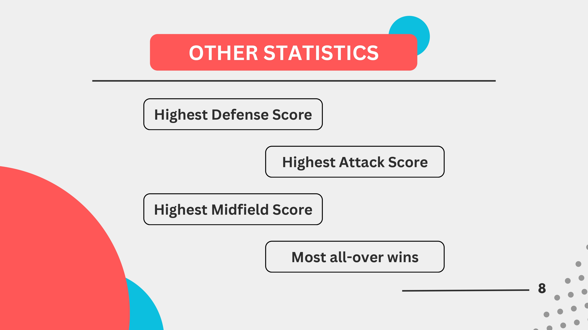<br/><br/>
    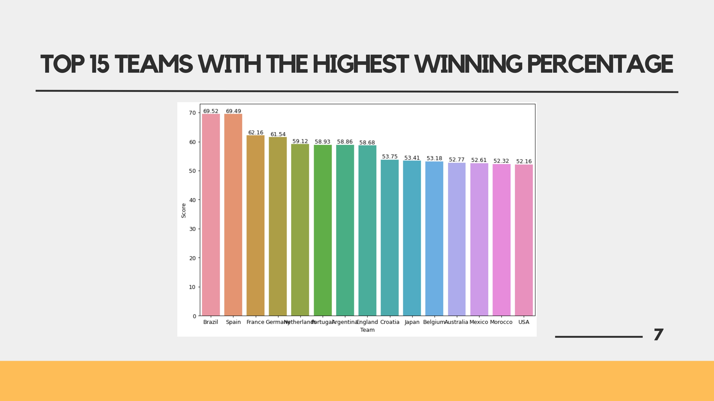
  </p>
</details>
